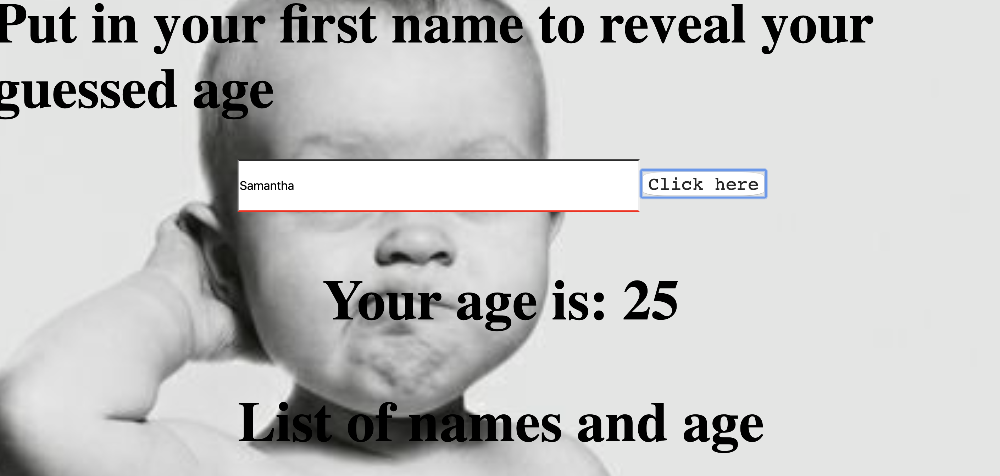

Guess your age!
User puts in a name and gets an age. They also are able to see a list of the names they have submitted in the past.

Install: clone repo
run npm install

To run this application: 'node server.js'
localhost:3000

To delete:
Copy and paste name 
Hit Delete button

